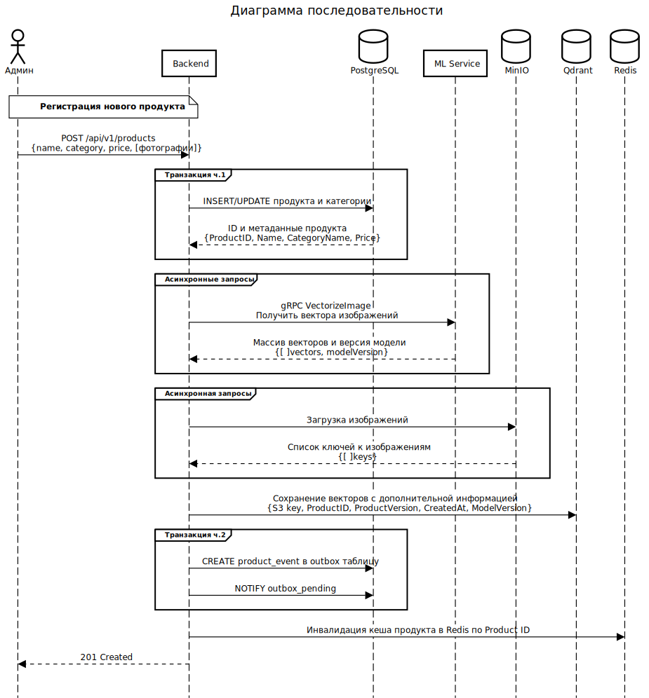
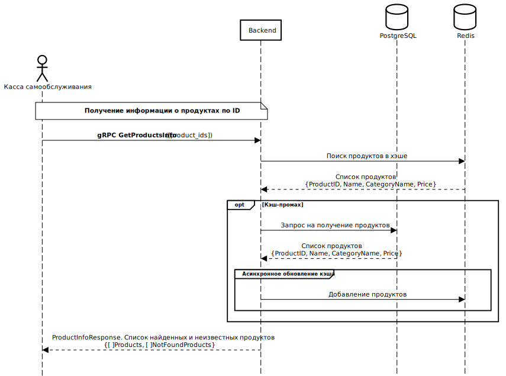
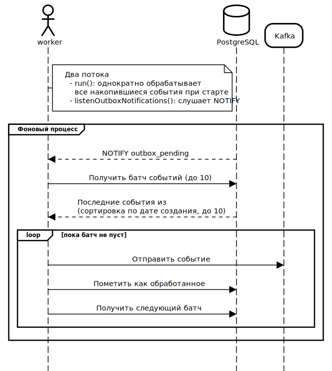

<div align="center">

  # Retail Vision Catalog Backend

  <a href="https://go.dev/"></a>
  <a href="https://www.postgresql.org/"></a>
  <a href="https://redis.io/"></a>
  <a href="https://kafka.apache.org/"></a>
  <a href="https://qdrant.tech/"></a>
  <a href="https://min.io/"></a>
  <a href="https://grpc.io/"></a>
  <a href="https://swagger.io/"></a>
  <a href="https://www.docker.com/"></a>
</div>

**Retail Vision Catalog** – это высокопроизводительный бэкенд-сервис для систем умного ритейла. Мы избавляем покупателей от необходимости искать штрихкоды, используя технологии компьютерного зрения для автоматического распознавания товаров на кассе.

## 🚀 Быстрый старт
1. Клонируйте репозитории (backend и ml-service)
    ```bash
    git clone git@github.com:DRSN-tech/go-backend.git
    gir clone git@github.com:DRSN-tech/ml-service.git
    ```
2. Перейдите в корневую папку проекта и добавьте подмодули (submodules)
    ```bash
    cd go-backend/
    git submodule update --init --recursive --remote
    ```
3. Создайте `.env` файл. Образец переменных окружения находится в файле `.env.example`
4. Выполните `sudo docker-compose up --build -d` в корневой папке проекта `go-backend`

## ⚡️ Преимущества
- **Computer Vision First**: Распознавание товаров в реальном времени без использования штрихкодов.
- **Reliability**: Надежная идентификация товаров даже при частичном перекрытии или плохом освещении.
- **Speed**: Максимальное ускорение пути покупателя «от полки до оплаты».
- **Seamless Integration**: Быстрая передача данных в кассовое ПО.

## 📖 API Documentation
- **Swagger**: `http://localhost:8080/swagger/index.html` (после запуска)
- **gRPC**: Описание сервисов в папке `api/proto/`

## 📊 Диаграммы последовательности
Регистрация продукта и ML-обработки товара


Получение списка продуктов


Схема работы фонового воркера и доставки событий


## ⚙️ Стек технологий

| Категория | Используемые инструменты |
| :--- | :--- |
| **Основной язык** | [](https://go.dev/) **1.24** |
| **Базы данных** | [](https://www.postgresql.org/) + [](https://redis.io/) (кэширование) |
| **ML & Search** | [](https://grpc.io/) + [](https://qdrant.tech/) (векторный поиск) |
| **Messaging** | [](https://kafka.apache.org/) (событийная архитектура) |
| **Хранилище** | [](https://min.io/) (S3 совместимое) |
| **Миграции** | [](https://github.com/golang-migrate/migrate) (versioning) |
| **API & Docs** | [](https://github.com/go-chi/chi) + [](https://swagger.io/) + [](https://grpc.io/) |
| **DevOps** | [](https://www.docker.com/) |

## ⌛️ Будущие изменения 
- Рефакторинг `RegisterNewProduct` — Переход на надёжную асинхронную регистрацию через **Outbox** паттерн. Обеспечить максимальную надёжность и восстанавливаемость при регистрации нового продукта с изображениями и векторами. Устранить риск орфаненных файлов в MinIO и несогласованности с Qdrant/Kafka при любых сбоях (включая SIGKILL, сетевые ошибки, перезапуски). Единственным источником истины будет основная база данных – в нашем случае PostgreSQL.
- Удалить `pkg/logger` и перейти на `slog/logger`. Реализовать информативное логирование, продумать метрики.
